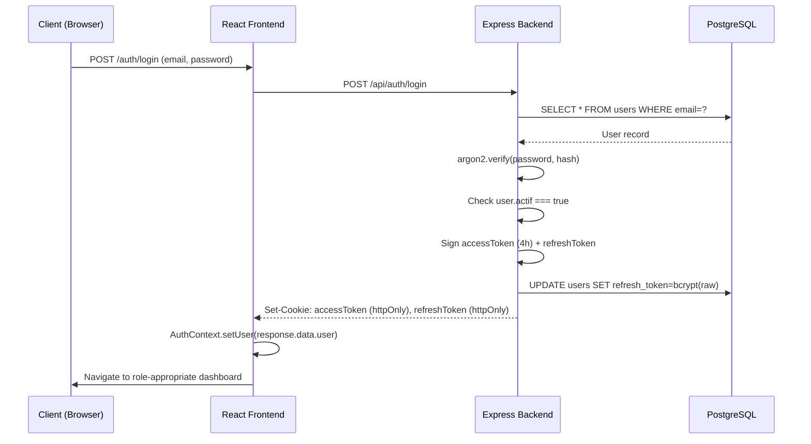
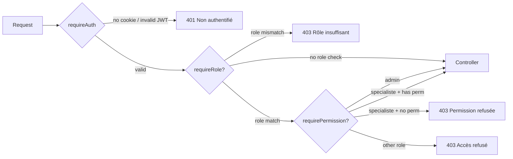
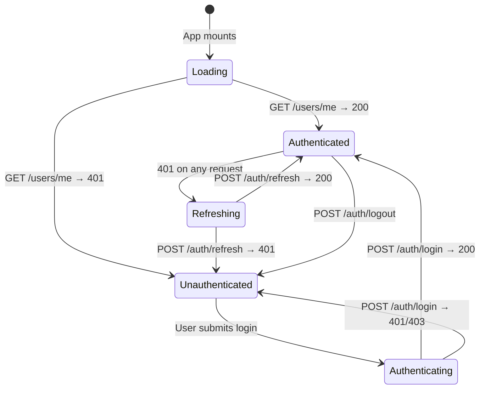
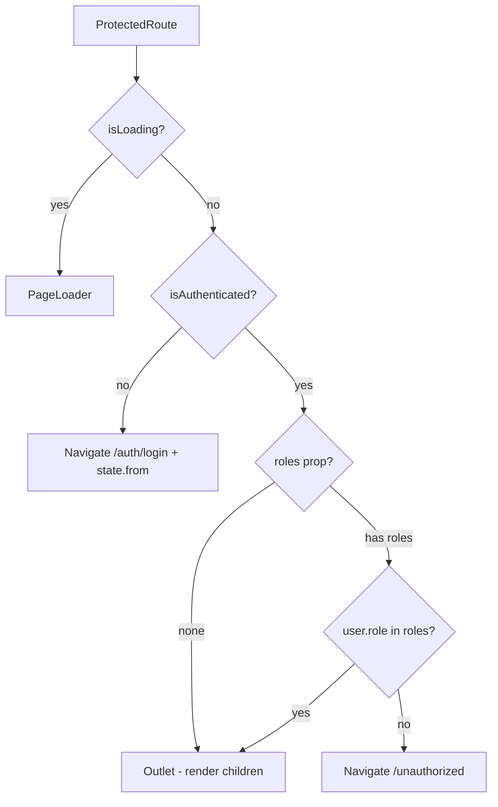

# Sprint 01 — Authentication / Registration / RBAC
**Status:** Planning
**Date:** 2026-03-09
**Stack:** Node.js ESM + Express 5 / React 18 + Vite + TS / PostgreSQL / TanStack Query

---

## 1. Codebase Audit — Current State

### 1.1 Backend — What Exists

| File | What it does |
|------|-------------|
| `authController.js` | `registerVendeur`, `registerFournisseur`, `login`, `refresh`, `logout`, `activateUser`, `forgotPassword`, `verifyResetToken`, `resetPassword` |
| `authMiddleware.js` | `requireAuth` (JWT cookie) + `requireAdmin` (role===admin only) |
| `permissionMiddleware.js` | `requirePermission(module, action)` — DB-checked for specialiste, admin bypassed |
| `routes/auth.js` | All auth endpoints documented + wired |
| `routes/admin.js` | `router.use(requireAuth, requireAdmin)` at top — but some individual routes re-add `requireAuth` redundantly |
| `routes/userRoutes.js` | `GET /users/me` returns full user profile with role info |
| `models/User.js` | roles: `vendeur`, `fournisseur`, `admin`, `specialiste` |

### 1.2 Backend — Bugs & Gaps Found

| ID | Location | Issue | Severity |
|----|----------|-------|----------|
| B1 | `permissionMiddleware.js:54` | All non-admin/specialiste roles get 403 — vendeur and fournisseur can never use permission-gated routes | HIGH |
| B2 | `admin.js:336` | `requirePermission` called with no module arg → `module=undefined` in DB query | HIGH |
| B3 | `admin.js:421` | Same — `requirePermission` with no arg on PATCH /tasks/:id/status | HIGH |
| B4 | `authController.js:232-236` | `login` only checks `user.actif` — does NOT check `user.validation` (email confirmed). A user with email-confirmed but not admin-activated gets "Compte non activé par l'admin" which is correct, but logic comment is misleading. Actually fine — but the activation flow sets `validation=true` (email), `actif` is set by admin separately. **Document this clearly.** | MEDIUM |
| B5 | `authController.js:288-298` | `refresh` uses `bcrypt.compareSync` inside a `.find()` loop over ALL users — O(n×bcrypt) on every refresh | HIGH |
| B6 | `authController.js:169-223` | `registerFournisseur` has no DB transaction — if `Fournisseur.create` fails after `User.create`, orphan user is left | HIGH |
| B7 | `authMiddleware.js` | No `requireRole(...roles)` helper — no way to guard vendeur-only or fournisseur-only routes | HIGH |
| B8 | `backend/package.json` | No `jest`, `supertest`, `@jest/globals` in devDeps, no jest config — TDD impossible | HIGH |
| B9 | `admin.js:39,72,97,497` | Some individual routes redundantly add `requireAuth` on top of `router.use(requireAuth, requireAdmin)` | LOW |
| B10 | No `GET /api/auth/me` | Only `/users/me` exists — there's no dedicated "who am I" auth endpoint | LOW |

### 1.3 Frontend — What Exists

| File | What it does |
|------|-------------|
| `App.tsx` | All routes, lazy-loaded. No RBAC guards at all. |
| `DashboardLayout.tsx` | Fetches `/users/me` on mount, redirects to `/auth/login` on 401. User state is **local** — not globally accessible. |
| `components/api.ts` | Axios instance with cookie-based auth + 401 auto-refresh interceptor |
| `components/utils/auth.js` | `logout()` helper — calls `/auth/logout`, then `window.location.href = '/auth/login'` |
| `context/LanguageContext.tsx` | i18n only — no AuthContext exists |

### 1.4 Frontend — Bugs & Gaps Found

| ID | Location | Issue | Severity |
|----|----------|-------|----------|
| F1 | `App.tsx` | **Zero RBAC protection on routes** — any authenticated user can navigate to `/adminDashboard`, `/admin/*`, `/specialist/*` | CRITICAL |
| F2 | `DashboardLayout.tsx` | User state is local component state — child pages can't access `user.role` without prop-drilling or their own API call | HIGH |
| F3 | `DashboardLayout.tsx:71` | `onLogout={() => {}}` — logout is not wired up at all in the layout | HIGH |
| F4 | `App.tsx:146` | `<Route path="*" element={<Navigate to="/dashboard" />} />` — unauthenticated users hitting `*` are redirected to dashboard (which itself redirects to login) — double redirect | MEDIUM |
| F5 | `Ecommerce/package.json` | **No `@tanstack/react-query`** — all data fetching is raw axios with no caching, no loading/error states management, no invalidation | HIGH |
| F6 | `components/utils/auth.js` | Uses `window.location.href` (full page reload) instead of React Router `navigate()` | LOW |
| F7 | No `AuthContext` | No global auth state — role-based UI rendering (sidebar items, menu) is done ad-hoc per component | HIGH |

---

## 2. Architecture Decision

### 2.1 Two-Layer RBAC Model (Backend)

```
Layer 1 — requireAuth          : JWT is valid → req.user populated
Layer 2a — requireRole(roles)  : req.user.role is in allowed list
Layer 2b — requirePermission   : (specialiste only) DB permission record check
```

Flow:
```
Request
  → requireAuth          → 401 if no/invalid JWT
  → requireRole('admin') → 403 if not admin
  → requirePermission    → 403 if specialist lacks module permission
  → Controller
```

### 2.2 Frontend Auth Architecture

```
AuthContext (React Context)
  ├─ state: { user, isLoading, isAuthenticated }
  ├─ useQuery(['me'], fetchMe)     ← TanStack Query
  ├─ login() mutation
  ├─ logout() mutation
  └─ exposed via useAuth() hook

ProtectedRoute
  ├─ checks isAuthenticated → redirect /auth/login
  └─ checks allowedRoles → redirect /unauthorized

App.tsx
  └─ <ProtectedRoute roles={['admin']}>  → admin pages
  └─ <ProtectedRoute roles={['vendeur']}> → vendeur pages
  └─ <ProtectedRoute roles={['specialiste']}> → specialist pages
  └─ <ProtectedRoute roles={['fournisseur']}> → fournisseur pages
```

---

## 3. Sub-Sprints

### Sub-Sprint 1 — Backend: Jest Setup + Auth Test Suite (TDD)

**Goal:** Install and configure Jest for ESM, write test suite covering all auth endpoints.

**Files to create/modify:**
- `backend/jest.config.js` — new
- `backend/tests/setup.js` — test DB helpers
- `backend/tests/auth.test.js` — auth endpoint tests
- `backend/package.json` — add jest, supertest devDeps

**Test cases to cover:**

```
POST /api/auth/register-vendeur
  ✓ 201 with valid payload
  ✓ 400 missing required fields
  ✓ 400 duplicate email
  ✓ 400 passwords don't match
  ✓ 400 weak password
  ✓ 400 invalid pack_cle

POST /api/auth/register-fournisseur
  ✓ 201 with valid payload
  ✓ 400 missing fields

GET /api/auth/activate?token=
  ✓ 200 activates account
  ✓ 400 invalid token
  ✓ 200 already activated (idempotent)

POST /api/auth/login
  ✓ 200 sets httpOnly cookies
  ✓ 401 wrong password
  ✓ 403 account not actif (actif=false)
  ✓ 401 user not found

POST /api/auth/refresh
  ✓ 200 rotates both cookies
  ✓ 401 missing cookie
  ✓ 401 tampered cookie

POST /api/auth/logout
  ✓ 200 clears cookies + nulls refresh_token

POST /api/auth/forgot-password
  ✓ 200 for existing email (sends mail)
  ✓ 200 for non-existing email (silent, no enumeration)

POST /api/auth/reset-password
  ✓ 200 password changed
  ✓ 400 invalid token
  ✓ 400 passwords don't match
  ✓ 400 weak password
```

**Technical setup:**
```js
// jest.config.js
export default {
  testEnvironment: 'node',
  transform: {},
  extensionsToTreatAsEsm: ['.js'],
  // Use --experimental-vm-modules for ESM
};
// package.json scripts:
"test": "node --experimental-vm-modules node_modules/.bin/jest"
```

---

### Sub-Sprint 2 — Backend: Fix Bugs + requireRole Middleware

**Goal:** Fix all HIGH severity bugs. Add `requireRole` factory.

#### 2.1 Fix `requireRole` in `authMiddleware.js`

```js
// ADD to authMiddleware.js
export function requireRole(...roles) {
  return (req, res, next) => {
    if (!req.user) return res.status(401).json({ message: 'Non authentifié' });
    if (!roles.includes(req.user.role)) {
      return res.status(403).json({ message: 'Accès refusé: rôle insuffisant' });
    }
    next();
  };
}
```

#### 2.2 Fix `registerFournisseur` — wrap in transaction (authController.js)

Apply same `sequelize.transaction()` pattern as `registerVendeur`.

#### 2.3 Fix `refresh` — async bcrypt (authController.js)

Add `user_id` to refresh token storage to avoid full-table scan:
- Store `{ userId, hashedToken }` — lookup by userId first, then verify hash
- OR: use a separate `refresh_tokens` table with `user_id` index

Short-term fix: change `compareSync` → async `bcrypt.compare` in the loop.

#### 2.4 Fix admin routes — `requirePermission` missing module arg

```js
// admin.js — current bugs:
router.delete("/permissions/:id", requirePermission, removePermission);  // BUG: no module
router.patch("/tasks/:id/status", requirePermission, updateTaskStatus);  // BUG: no module

// FIXED:
router.delete("/permissions/:id", removePermission);  // admin-only, no specialist here
router.patch("/tasks/:id/status", updateTaskStatus);  // admin-only
```

#### 2.5 Add `requireRole` guards to domain routes

```js
// Example: commandesRoutes.js
router.use(requireAuth, requireRole('vendeur', 'admin', 'specialiste'));

// demandeRetraitRoutes.js
router.use(requireAuth, requireRole('vendeur', 'admin'));

// pickupRoute.js
router.use(requireAuth, requireRole('fournisseur', 'admin'));
```

**Files modified:** `authMiddleware.js`, `authController.js`, `routes/admin.js`, `routes/commandesRoutes.js`, `routes/demandeRetraitRoutes.js`, `routes/pickupRoute.js`, `routes/mesProduitsRoutes.js`, `routes/dashboardRoutes.js`, `routes/dashboardFRoutes.js`

**Tests to add:**
```
requireRole middleware
  ✓ passes if role matches
  ✓ 403 if role doesn't match
  ✓ 401 if no user on req

requirePermission middleware
  ✓ admin bypasses all
  ✓ specialiste with matching permission passes
  ✓ specialiste without permission → 403
  ✓ vendeur role → 403 (not admin/specialiste)
  ✓ missing module arg handled gracefully
```

---

### Sub-Sprint 3 — Frontend: Install TanStack Query + AuthContext

**Goal:** Install `@tanstack/react-query`, create global `AuthContext`, replace raw axios in DashboardLayout.

#### 3.1 Install TanStack Query

```bash
cd Ecommerce
npm install @tanstack/react-query @tanstack/react-query-devtools
```

#### 3.2 Create `AuthContext.tsx`

**File:** `Ecommerce/src/context/AuthContext.tsx`

```tsx
// Provides: user, isLoading, isAuthenticated, login(), logout()
// Uses useQuery(['me'], () => api.get('/users/me').then(r => r.data))
// QueryClient staleTime: 5 minutes
// On 401: user = null
```

Structure:
```
src/
  context/
    AuthContext.tsx      ← new
    LanguageContext.tsx  ← existing
  hooks/
    useAuth.ts          ← re-export useContext(AuthContext)
    usePermissions.ts   ← specialist permission helper
```

#### 3.3 Wire QueryClientProvider + AuthProvider in `main.tsx`

```tsx
<QueryClientProvider client={queryClient}>
  <AuthProvider>
    <BrowserRouter>
      <App />
    </BrowserRouter>
  </AuthProvider>
  <ReactQueryDevtools />
</QueryClientProvider>
```

#### 3.4 Refactor `DashboardLayout.tsx`

- Remove local `user` state and manual `fetchUser()`
- Use `const { user, isLoading } = useAuth()`
- Wire `onLogout` to `logout()` from AuthContext

---

### Sub-Sprint 4 — Frontend: ProtectedRoute + RBAC Guards

**Goal:** Add role-based route protection to all dashboard routes.

#### 4.1 Create `ProtectedRoute.tsx`

**File:** `Ecommerce/src/components/ProtectedRoute.tsx`

```tsx
interface ProtectedRouteProps {
  roles?: UserRole[];  // if empty, only checks authentication
  redirectTo?: string;
}

// Logic:
// 1. isLoading → show PageLoader
// 2. !isAuthenticated → <Navigate to="/auth/login" state={{ from: location }} />
// 3. roles provided && !roles.includes(user.role) → <Navigate to="/unauthorized" />
// 4. else → <Outlet />
```

#### 4.2 Add `/unauthorized` page

**File:** `Ecommerce/src/page/Unauthorized.tsx`
- Simple "Accès refusé" page with role info and link back to dashboard

#### 4.3 Restructure `App.tsx` routes

```tsx
{/* Public — no auth needed */}
<Route path="/" element={<HomePage />} />
<Route path="/auth/*" element={<AuthPages />} />
<Route path="/auth/login" element={<Login />} />
<Route path="/auth/signup" element={<SignUp />} />
<Route path="/auth/forgot-password" element={<ForgotPassword />} />
<Route path="/auth/reset-password" element={<ResetPassword />} />
<Route path="/unauthorized" element={<Unauthorized />} />

{/* Authenticated — any role */}
<Route element={<ProtectedRoute />}>
  <Route element={<DashboardLayout />}>
    <Route path="/settings" element={<Settings />} />
    <Route path="/notifications" element={<NotificationsPage />} />
    <Route path="/ticket" element={<TicketsList />} />
    <Route path="/ticket/create" element={<CreateTicket />} />
    <Route path="/ticket/:id" element={<TicketDetail />} />
  </Route>
</Route>

{/* Admin only */}
<Route element={<ProtectedRoute roles={['admin']} />}>
  <Route element={<DashboardLayout />}>
    <Route path="/adminDashboard" element={<AdminDashboard />} />
    <Route path="/adminUsers" element={<AdminUsers />} />
    <Route path="/admin/specialists" element={<AdminSpecialists />} />
    <Route path="/admin/permissions" element={<AdminPermissions />} />
    <Route path="/admin/tasks" element={<AdminTasks />} />
    <Route path="/AdminParrainage" element={<AdminParrainagePage />} />
    <Route path="/demandeRetrait" element={<AdminDemandesRetrait />} />
  </Route>
</Route>

{/* Vendeur only */}
<Route element={<ProtectedRoute roles={['vendeur']} />}>
  <Route element={<DashboardLayout />}>
    <Route path="/dashboard" element={<Dashboard />} />
    <Route path="/marketplace" element={<Products />} />
    <Route path="/MesProduits" element={<MesProduits />} />
    <Route path="/products/:id" element={<ProductDetail />} />
    <Route path="/CreerCommande" element={<CreerCommande />} />
    <Route path="/ListeCommandes" element={<ListeCommandes />} />
    <Route path="/commande/:id" element={<CommandeDetails />} />
    <Route path="/transaction" element={<Transactions />} />
    <Route path="/HistoriqueTransactions" element={<HistoriqueTransactions />} />
    <Route path="/VendeurParrainage" element={<VendeurParrainagePage />} />
  </Route>
</Route>

{/* Fournisseur only */}
<Route element={<ProtectedRoute roles={['fournisseur']} />}>
  <Route element={<DashboardLayout />}>
    <Route path="/dashboardF" element={<DashboardF />} />
    <Route path="/ProductList" element={<ProductList />} />
    <Route path="/ListeCommandeFournisseur" element={<ListeCommandeFournisseur />} />
    <Route path="/CommandeDetailsFournisseur/:id" element={<CommandeDetailsFournisseur />} />
    <Route path="/pickup" element={<PickupPage />} />
  </Route>
</Route>

{/* Spécialiste only */}
<Route element={<ProtectedRoute roles={['specialiste']} />}>
  <Route element={<DashboardLayout />}>
    <Route path="/specialist/dashboard" element={<SpecialistDashboard />} />
    <Route path="/specialist/users" element={<SpecialistUsers />} />
    <Route path="/specialist/products" element={<SpecialistProducts />} />
    <Route path="/specialist/products/new" element={<SpecialistCreateProduct />} />
    <Route path="/specialist/products/edit/:id" element={<SpecialistEditProduct />} />
    <Route path="/specialist/tasks" element={<SpecialistTasks />} />
  </Route>
</Route>

{/* Admin OR Specialist */}
<Route element={<ProtectedRoute roles={['admin', 'specialiste']} />}>
  <Route element={<DashboardLayout />}>
    <Route path="/shop" element={<Shop />} />
  </Route>
</Route>

{/* Fallback — redirect to role-appropriate dashboard */}
<Route path="*" element={<RoleBasedRedirect />} />
```

#### 4.4 Create `RoleBasedRedirect` component

```tsx
// Reads user.role and redirects to appropriate dashboard
// vendeur → /dashboard
// fournisseur → /dashboardF
// admin → /adminDashboard
// specialiste → /specialist/dashboard
// unauthenticated → /auth/login
```

#### 4.5 Update `Login.tsx` to use `RoleBasedRedirect` after login

On successful login, instead of hardcoded redirect, use role-aware navigation.

---

### Sub-Sprint 5 — Frontend: Migrate API Calls to TanStack Query

**Goal:** Progressively replace raw `axios` calls in pages with `useQuery`/`useMutation` hooks. Start with the most-used pages.

**Priority order:**
1. `useAuth` — `GET /users/me` (AuthContext)
2. Dashboard stats — `GET /admin/dashboard`, `GET /dashboard`
3. Users list — `GET /admin/users`
4. Products — `GET /produits`
5. Orders — `GET /commandes`

**Pattern to follow:**
```tsx
// hooks/queries/useAdminUsers.ts
export function useAdminUsers(filters?: { role?: string; q?: string }) {
  return useQuery({
    queryKey: ['admin', 'users', filters],
    queryFn: () => api.get('/admin/users', { params: filters }).then(r => r.data),
    staleTime: 30_000,
  });
}

// hooks/mutations/useUpdateUserStatus.ts
export function useUpdateUserStatus() {
  const queryClient = useQueryClient();
  return useMutation({
    mutationFn: ({ id, actif }: { id: number; actif: boolean }) =>
      api.patch(`/admin/users/${id}/status`, { actif }).then(r => r.data),
    onSuccess: () => queryClient.invalidateQueries({ queryKey: ['admin', 'users'] }),
  });
}
```

**Files to create:**
```
Ecommerce/src/hooks/
  queries/
    useMe.ts
    useAdminUsers.ts
    useAdminDashboard.ts
    useProducts.ts
    useCommandes.ts
    usePermissions.ts
  mutations/
    useLogin.ts
    useLogout.ts
    useRegisterVendeur.ts
    useUpdateUserStatus.ts
```

---

## 4. Implementation Order (Safe for Deployed VPS)

```
Week 1
  Day 1-2: Sub-Sprint 1  (Jest setup + auth tests — backend only, no breaking changes)
  Day 3-4: Sub-Sprint 2  (Fix bugs — all backward compatible)
  Day 5:   Deploy + smoke test on VPS

Week 2
  Day 1-2: Sub-Sprint 3  (TanStack Query + AuthContext — additive, no breaking changes)
  Day 3-4: Sub-Sprint 4  (ProtectedRoute — fixes the CRITICAL F1 gap)
  Day 5:   Sub-Sprint 5 (start) + Deploy + full regression test

Week 3
  Day 1-3: Sub-Sprint 5 (complete query migration)
  Day 4-5: E2E smoke test on VPS + docs update
```

---

## 5. Risk Register

| Risk | Mitigation |
|------|------------|
| Jest + ESM is tricky (Node ESM + jest) | Use `--experimental-vm-modules` + explicit transform config |
| `requireRole` breaking existing routes | Add incrementally with tests first, never remove `requireAuth` |
| TanStack Query + AuthContext refactor breaks DashboardLayout | Keep fallback path: if `useAuth` fails, still redirect to /auth/login |
| ProtectedRoute wildcard redirect loop | `RoleBasedRedirect` must handle unauthenticated users first |
| VPS deploy with DB-touching changes | Sub-Sprint 2 fixes are code-only (no migrations needed) |

---

## 6. File Change Map

### Backend new/modified files

| File | Action | Sub-Sprint |
|------|--------|-----------|
| `backend/package.json` | Add jest, supertest devDeps | 1 |
| `backend/jest.config.js` | New | 1 |
| `backend/tests/auth.test.js` | New | 1 |
| `backend/tests/middleware.test.js` | New | 2 |
| `backend/src/middlewares/authMiddleware.js` | Add `requireRole` | 2 |
| `backend/src/controllers/authController.js` | Fix `registerFournisseur` tx, fix refresh perf | 2 |
| `backend/src/routes/admin.js` | Fix `requirePermission` no-arg bug, remove redundant `requireAuth` | 2 |
| `backend/src/routes/commandesRoutes.js` | Add `requireRole` | 2 |
| `backend/src/routes/demandeRetraitRoutes.js` | Add `requireRole` | 2 |
| `backend/src/routes/pickupRoute.js` | Add `requireRole` | 2 |
| `backend/src/routes/dashboardRoutes.js` | Add `requireRole` | 2 |
| `backend/src/routes/dashboardFRoutes.js` | Add `requireRole` | 2 |

### Frontend new/modified files

| File | Action | Sub-Sprint |
|------|--------|-----------|
| `Ecommerce/package.json` | Add @tanstack/react-query | 3 |
| `Ecommerce/src/main.tsx` | Add QueryClientProvider + AuthProvider | 3 |
| `Ecommerce/src/context/AuthContext.tsx` | New | 3 |
| `Ecommerce/src/hooks/useAuth.ts` | New | 3 |
| `Ecommerce/src/components/DashboardLayout.tsx` | Refactor to use useAuth | 3 |
| `Ecommerce/src/components/ProtectedRoute.tsx` | New | 4 |
| `Ecommerce/src/page/Unauthorized.tsx` | New | 4 |
| `Ecommerce/src/components/RoleBasedRedirect.tsx` | New | 4 |
| `Ecommerce/src/App.tsx` | Full RBAC route restructure | 4 |
| `Ecommerce/src/components/Login.tsx` | Use role-based redirect | 4 |
| `Ecommerce/src/hooks/queries/*.ts` | New (8 files) | 5 |
| `Ecommerce/src/hooks/mutations/*.ts` | New (5 files) | 5 |

---

## 7. Mermaid Diagrams

### Auth Flow



### RBAC Middleware Chain



### Frontend Auth State Machine



### ProtectedRoute Decision Tree



---

## 8. Definition of Done

- [ ] All auth endpoints have jest test coverage ≥ 80%
- [ ] `requireRole` middleware has tests
- [ ] `registerFournisseur` uses transaction (B6 fixed)
- [ ] `refresh` no longer uses `compareSync` in loop (B5 fixed)
- [ ] `requirePermission` no-arg bug fixed on admin routes (B2, B3 fixed)
- [ ] All dashboard routes are behind `ProtectedRoute` with correct roles (F1 fixed)
- [ ] `AuthContext` provides `user`, `isLoading`, `isAuthenticated`, `logout` globally (F2, F3 fixed)
- [ ] `DashboardLayout` uses `useAuth()` instead of local fetch (F2 fixed)
- [ ] Login redirects to role-appropriate dashboard
- [ ] `/unauthorized` page exists and is styled
- [ ] TanStack Query installed and used for at least `useMe` + `useAdminUsers`
- [ ] No regression on deployed features (orders, tickets, products, parrainage)
- [ ] VPS deploy successful with health check passing
