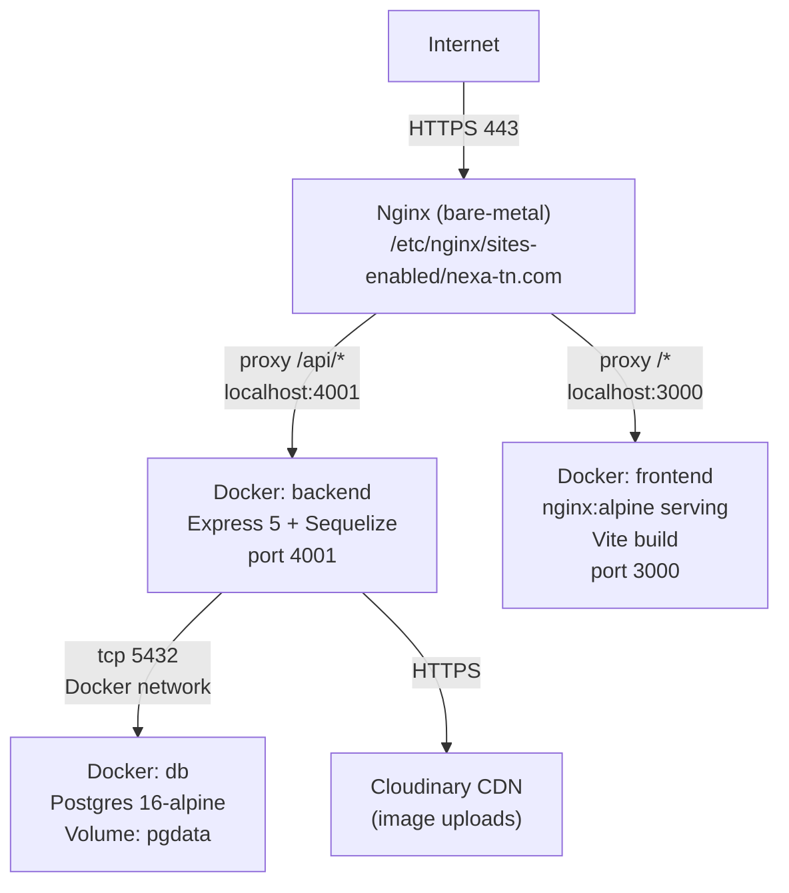
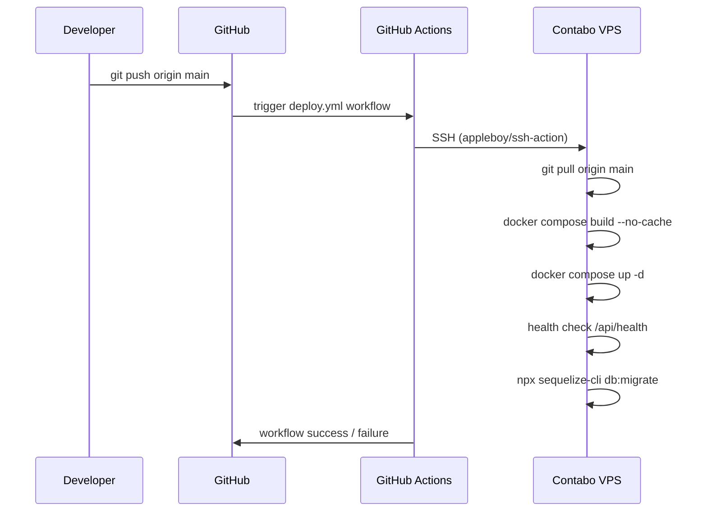
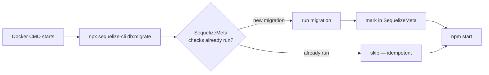
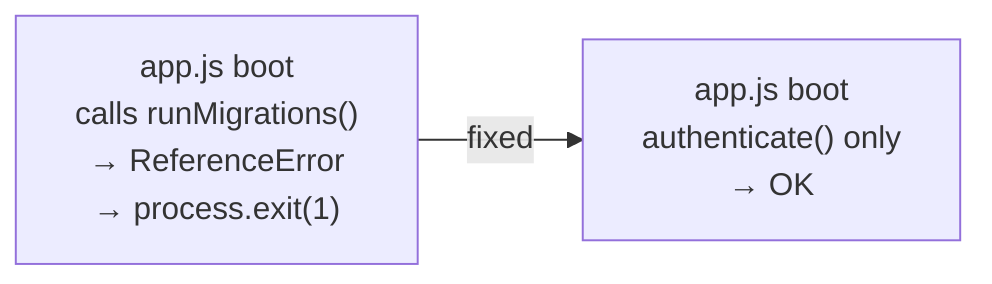
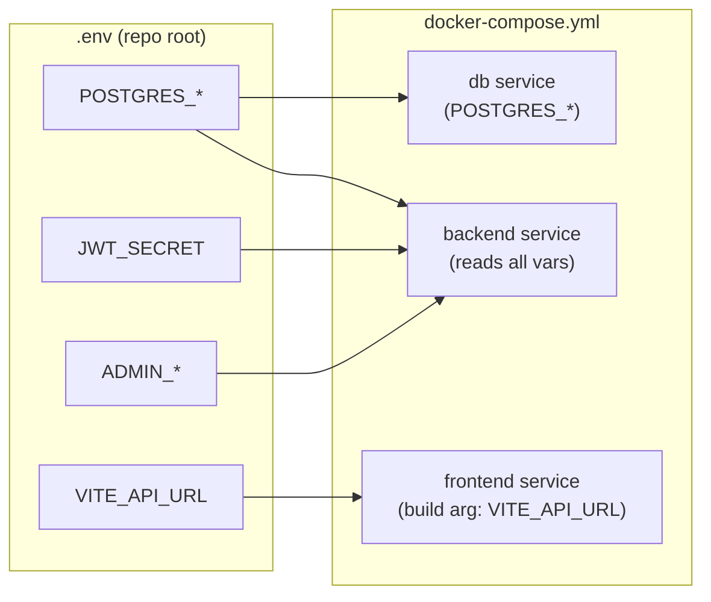

# Sprint Report — CI/CD Workflow

## Overview

This sprint fixed all blocking bugs that prevented successful deployment to the Contabo VPS
and established a complete, automated CI/CD pipeline via GitHub Actions.

---

## Architecture

### Production Stack



### CI/CD Flow



### Database Migration Lifecycle



---

## Bugs Fixed

### 1. Fatal: `runMigrations()` called but undefined in production

**File:** `backend/src/app.js`

The production startup block called `runMigrations()` whose implementation was inside
a comment block. This caused an immediate `ReferenceError` crash on every production boot.

**Fix:** Removed the broken IIFE. The Dockerfile CMD already handles migrations
(`npx sequelize-cli db:migrate && npm start`). The app now only verifies the DB
connection on boot.



---

### 2. Fatal: `require('../config/config.json')` — file does not exist

**File:** `backend/models/index.js` (Sequelize CLI model dir)

The auto-generated `index.js` tried to load `config.json` which never existed
(the project uses `config.cjs`). This crashed `sequelize-cli db:migrate` before
any migration ran.

**Fix:** Removed the unused `require` — the Sequelize instance is constructed
directly from `process.env.DATABASE_URL`.

---

### 3. Fatal: Seed not idempotent — crashes on re-run

**File:** `backend/seeders/seed.js`

Every `User.create()` call would throw a unique constraint violation if the seed
had already been run once. In dev mode, `sequelize.sync({ force: true })` wiped
the entire database on every seed run.

**Fix:** Replaced all `create()` calls with `findOrCreate()` keyed on `email` /
`name`. Added a guard: the `Fournisseur` record for admin is only created when
the admin user was just inserted. The DB wipe was removed entirely.

---

### 4. Fatal: Frontend API URL hardcoded to `localhost:4001`

**File:** `Ecommerce/src/components/api.ts`

Browser requests from a real user's machine to `http://localhost:4001/api` go
nowhere in production.

**Fix:** The base URL now reads from `import.meta.env.VITE_API_URL` with a
fallback to `localhost:4001` for local dev. The Vite build arg is injected at
Docker build time via `--build-arg VITE_API_URL=https://nexa-tn.com/api`.

---

### 5. Backend port mismatch

**File:** `docker-compose.yml`

The backend `expose` declared port `4001` but `PORT` env var was set to `4000`.
Nginx would have proxied to a dead port.

**Fix:** Standardized both to `4001`. Ports are now bound to `127.0.0.1` only,
preventing direct public access (all traffic must go through nginx).

---

### 6. `initial_db.js` bad import path for seed

**File:** `backend/scripts/initial_db.js`

The script spawned `node seeders/seed.js` but `seed.js` used relative imports
(`./config/database.js`, `./models/User.js`) that resolved relative to the
`seeders/` directory, not the backend root.

**Fix:** Seed now imports from `../src/config/database.js` etc. (correct relative
paths from `seeders/`). `initial_db.js` passes the backend root as `cwd`.

---

## New Files Created

| File | Purpose |
|------|---------|
| `.env.example` | Root-level env vars for `docker-compose` |
| `backend/.env.example` | Backend env vars for local development |
| `Ecommerce/.env.example` | Frontend env var (`VITE_API_URL`) |
| `Ecommerce/nginx.conf` | nginx config inside the frontend Docker container (SPA routing, asset caching) |
| `nginx/nexa-tn.com.conf` | Bare-metal nginx on VPS — reverse proxies `/api/*` → backend, `/*` → frontend |
| `.github/workflows/deploy.yml` | GitHub Actions CI/CD pipeline |

---

## GitHub Actions Setup

Add the following **Secrets** in `GitHub → Settings → Secrets → Actions`:

| Secret | Value |
|--------|-------|
| `VPS_HOST` | Your Contabo VPS public IP |
| `VPS_USER` | SSH user (e.g. `deploy`) |
| `VPS_SSH_KEY` | Private key content (the one whose public key is in `~/.ssh/authorized_keys` on VPS) |
| `VPS_PORT` | SSH port (default `22`) |
| `APP_DIR` | Absolute path to the repo on the VPS (e.g. `/home/deploy/nexa-ecommerce`) |

---

## VPS First-Time Setup

Run these steps once manually on the server:

```bash
# 1. Clone the repo
git clone https://github.com/YOUR_ORG/nexa-ecommerce.git ~/nexa-ecommerce
cd ~/nexa-ecommerce

# 2. Create .env from example and fill in real values
cp .env.example .env
nano .env

# 3. Start containers
docker compose up -d --build

# 4. Run initial seed (only once — idempotent so safe to re-run)
docker compose exec backend node scripts/initial_db.js

# 5. Install nginx if not present
sudo apt install -y nginx certbot python3-certbot-nginx

# 6. Copy nginx site config
sudo cp nginx/nexa-tn.com.conf /etc/nginx/sites-available/nexa-tn.com
sudo ln -s /etc/nginx/sites-available/nexa-tn.com /etc/nginx/sites-enabled/

# 7. Test and reload nginx
sudo nginx -t && sudo systemctl reload nginx

# 8. Get SSL certificate
sudo certbot --nginx -d nexa-tn.com -d www.nexa-tn.com

# 9. (Optional) Remove the under-construction placeholder
sudo rm -rf /var/www/nexa-tn.com   # adjust path if different
```

After this, every `git push` to `main` will automatically redeploy.

---

## Environment Variable Reference



---

## Remaining Manual Step

SSH access to the VPS is needed to:
1. Copy `nginx/nexa-tn.com.conf` to `/etc/nginx/sites-available/`
2. Obtain the SSL certificate with `certbot`
3. Remove the under-construction placeholder (provide the path)
4. Run the initial seed: `docker compose exec backend node scripts/initial_db.js`

Provide VPS IP, SSH user, and placeholder path to complete Strike 8 live on the server.
