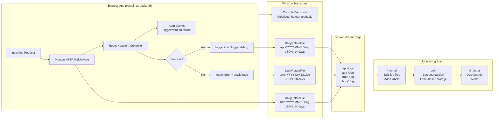
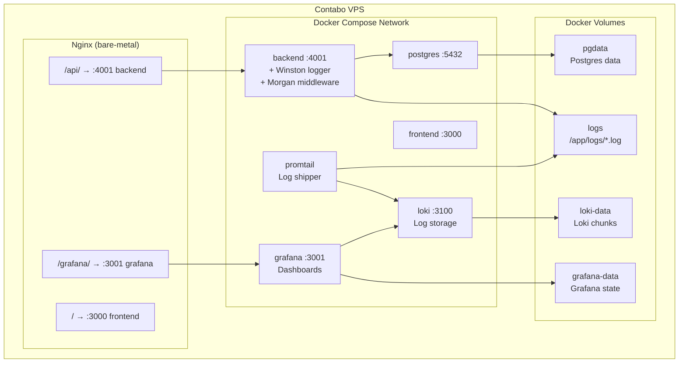
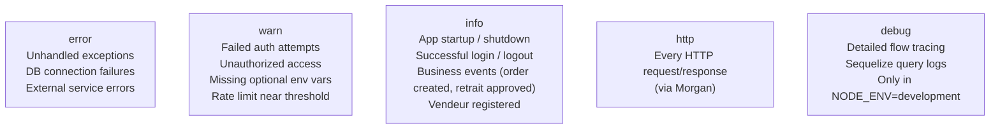
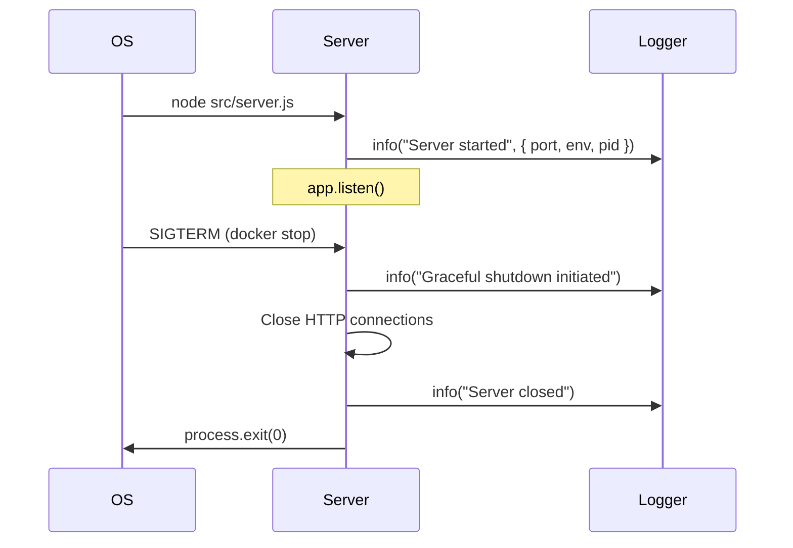
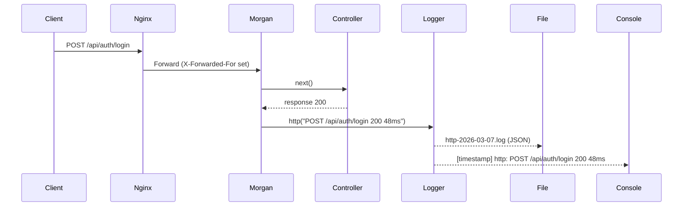
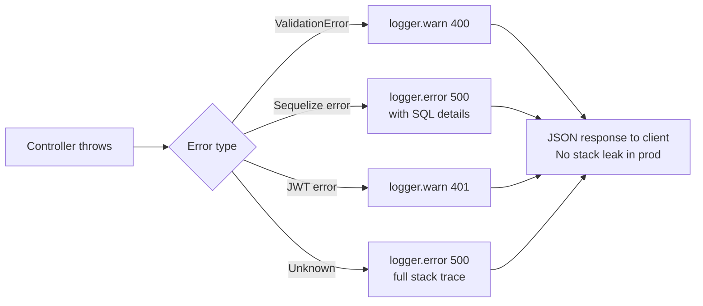
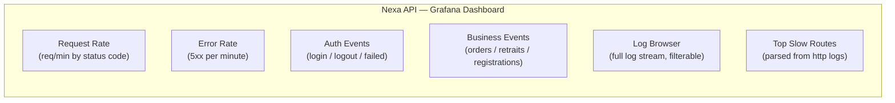
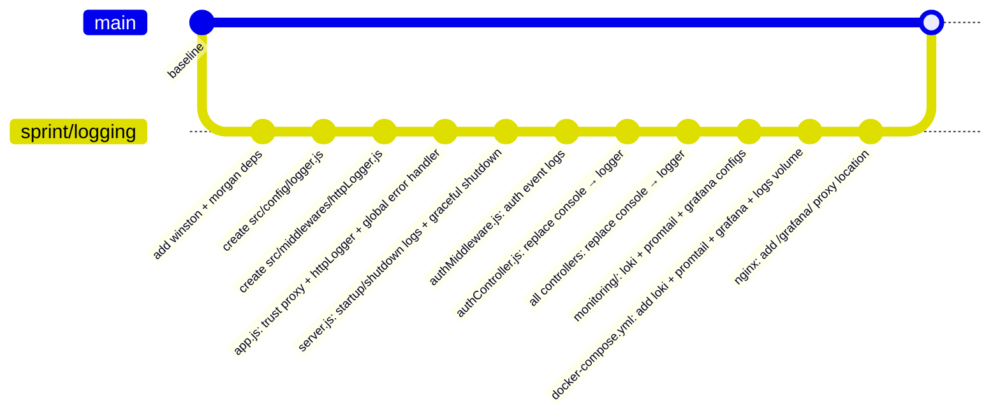

# Sprint — Structured API Logging + Grafana/Loki Observability Stack

**Date:** 2026-03-07
**Status:** Implementation
**Author:** Claude Code

---

## 1. Problem Statement

The current backend has no structured logging. Every controller uses raw `console.error()` / `console.log()` calls scattered across 10+ files. Consequences:

- HTTP access logs don't exist — no request/response tracing
- Errors are unstructured plain text → impossible to query or alert on
- No persistent log files — Docker container restart = logs gone
- No visibility into auth events, business operations, or slow queries
- Zero observability tooling deployed in production

---

## 2. Goals

| Goal | Detail |
|------|--------|
| Structured logs | JSON format with timestamp, level, requestId, userId, route, latency |
| HTTP access logs | Every request/response captured via Morgan → Winston |
| File rotation | Daily rotating files, 14-day retention, gzip-compressed |
| Auth event logs | Login, logout, register, token refresh, failed auth attempts |
| Business event logs | Order creation, withdrawal request, vendor registration |
| Error centralization | Global Express error handler, all caught errors routed through logger |
| Production observability | Grafana + Loki + Promtail stack deployed via Docker Compose |
| Nginx integration | Grafana accessible at `https://nexa-tn.com/grafana/` |

---

## 3. Technology Choices

### Why Grafana + Loki over ELK ?

| Criterion | ELK (Elasticsearch + Logstash + Kibana) | Grafana + Loki + Promtail |
|-----------|----------------------------------------|---------------------------|
| RAM footprint | 4–8 GB | ~400 MB |
| Log storage | Full-text index (expensive) | Label-only index (cheap) |
| Query language | Lucene / KQL | LogQL (SQL-like, simple) |
| Setup complexity | High (3 services + configs) | Low (3 lightweight services) |
| Suitable for VPS | No | Yes |
| JSON log parsing | Yes | Yes (via pipeline stages) |

**Decision: Grafana + Loki + Promtail**

### Node.js Logging Stack

| Package | Role |
|---------|------|
| `winston` | Core logger, multi-transport, log levels |
| `winston-daily-rotate-file` | Daily file rotation with gzip compression |
| `morgan` | HTTP request/response access log middleware |

---

## 4. Architecture

### 4.1 Log Flow



### 4.2 Docker Service Topology



---

## 5. Log Levels & When to Use Them



---

## 6. Instrumentation Points

### 6.1 Application Lifecycle (`server.js`)



### 6.2 HTTP Request Lifecycle (Morgan + Winston)



### 6.3 Auth Events (`authController.js` + `authMiddleware.js`)

| Event | Level | Fields |
|-------|-------|--------|
| `registerVendeur` success | `info` | userId, email, pack, ip |
| `login` success | `info` | userId, role, ip |
| `login` failed (bad password) | `warn` | email, ip, reason |
| `login` failed (user not found) | `warn` | email, ip |
| Token expired | `warn` | userId, route |
| Token invalid | `warn` | ip, route |
| `logout` | `info` | userId |
| Password reset requested | `info` | email, ip |
| Account activated | `info` | userId |
| Activation email failed | `warn` | userId, error |

### 6.4 Business Events (Controllers)

| Controller | Events Logged |
|-----------|---------------|
| `commandeController` | Order created (orderId, vendeurId, total), order status changed |
| `adminController` | User status changed, permission assigned, specialist assigned |
| `userController` | Profile updated, avatar uploaded |
| `specialistController` | Task assigned, task status updated, product validated |
| `demandeRetraitController` | Withdrawal requested, approved, rejected |
| `pickupController` | Pickup scheduled, completed |
| `parrainageController` | Parrainage applied, bonus credited |
| `ticketsController` | Ticket created, ticket replied, ticket closed |

### 6.5 Global Error Handler (`app.js`)



---

## 7. Log File Structure

```
/app/logs/                          ← Docker volume mount point
├── app-2026-03-07.log              ← All levels ≥ info (JSON, 14 days)
├── app-2026-03-07.log.gz           ← Previous days compressed
├── error-2026-03-07.log            ← Errors only (JSON, 30 days)
└── http-2026-03-07.log             ← HTTP access log (JSON, 14 days)
```

### Sample JSON log line

```json
{
  "timestamp": "2026-03-07T14:23:01.456Z",
  "level": "info",
  "message": "Vendeur registered",
  "userId": 42,
  "email": "vendor@example.com",
  "pack": "starter",
  "ip": "197.12.34.56",
  "service": "nexa-backend"
}
```

---

## 8. Promtail Pipeline — Label Strategy

```mermaid
flowchart TD
    A["Log file: /var/log/nexa/app-*.log"] --> B[Promtail reads line]
    B --> C{Is JSON?}
    C -- Yes --> D["Extract labels:\nlevel, service"]
    C -- No --> E["label: level=unknown"]
    D & E --> F["Push to Loki with labels:\n{job='nexa-backend', level='error'}"]
    F --> G[Grafana LogQL query:\n{job='nexa-backend', level='error'}]
```

---

## 9. Grafana Dashboard Panels



---

## 10. Nginx — Grafana Sub-path

Add to `nginx/nexa-tn.com.conf` inside the HTTPS server block:

```nginx
location /grafana/ {
    proxy_pass         http://127.0.0.1:3001/;
    proxy_http_version 1.1;
    proxy_set_header   Host $host;
    proxy_set_header   X-Real-IP $remote_addr;
    proxy_set_header   X-Forwarded-For $proxy_add_x_forwarded_for;
    proxy_set_header   X-Forwarded-Proto $scheme;
}
```

---

## 11. File Change Summary



### Files Created

| File | Purpose |
|------|---------|
| `backend/src/config/logger.js` | Winston logger instance with all transports |
| `backend/src/middlewares/httpLogger.js` | Morgan → Winston HTTP access log |
| `monitoring/loki-config.yml` | Loki server configuration |
| `monitoring/promtail-config.yml` | Promtail scrape config for log files |
| `monitoring/grafana/provisioning/datasources/loki.yml` | Auto-provision Loki datasource |
| `monitoring/grafana/provisioning/dashboards/dashboard.yml` | Auto-provision dashboard folder |
| `monitoring/grafana/dashboards/nexa-api.json` | Pre-built Nexa API dashboard |

### Files Modified

| File | Changes |
|------|---------|
| `backend/package.json` | Add `winston`, `winston-daily-rotate-file`, `morgan` |
| `backend/src/app.js` | Import httpLogger, global error handler |
| `backend/src/server.js` | Startup/shutdown log + SIGTERM handler |
| `backend/src/middlewares/authMiddleware.js` | Auth failure/success logs |
| `backend/src/controllers/*.js` | Replace `console.*` → `logger.*` (all 10 controllers) |
| `backend/src/config/database.js` | Sequelize slow-query logging in dev |
| `docker-compose.yml` | Add loki, promtail, grafana services + logs/loki/grafana volumes |
| `nginx/nexa-tn.com.conf` | Add `/grafana/` proxy location |

---

## 12. Post-Deploy Checklist

- [ ] `docker compose up --build -d` on VPS
- [ ] Verify `docker logs nexa-app-backend-1` shows structured JSON in console
- [ ] Verify `/app/logs/` volume has rotating log files (`docker exec backend ls /app/logs`)
- [ ] Open `https://nexa-tn.com/grafana/` → login (admin / from .env GRAFANA_PASSWORD)
- [ ] Verify Loki datasource is connected (Grafana → Connections → Data Sources)
- [ ] Open Nexa API dashboard → confirm logs stream in
- [ ] Add `GRAFANA_PASSWORD` to `.env` on VPS
- [ ] Update Nginx config on VPS and `nginx -t && systemctl reload nginx`

---

## 13. Environment Variables Added

Add to root `.env` on VPS:

```env
# Observability
GRAFANA_USER=admin
GRAFANA_PASSWORD=<choose-a-strong-password>
LOG_LEVEL=info
```
