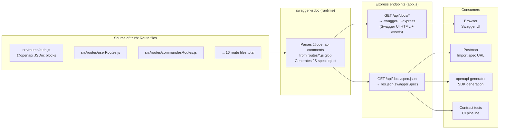
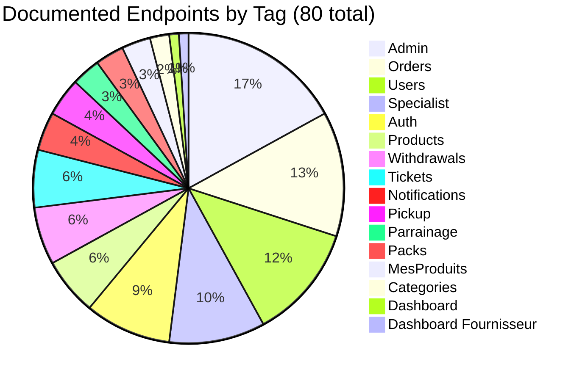
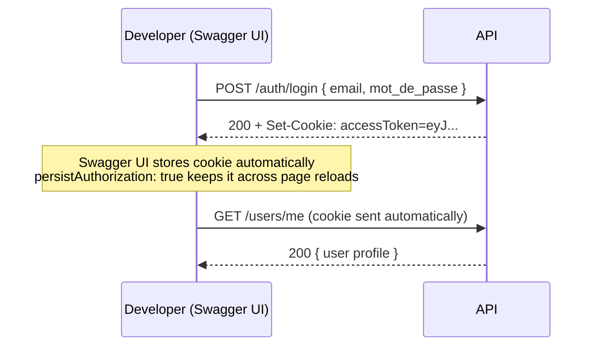
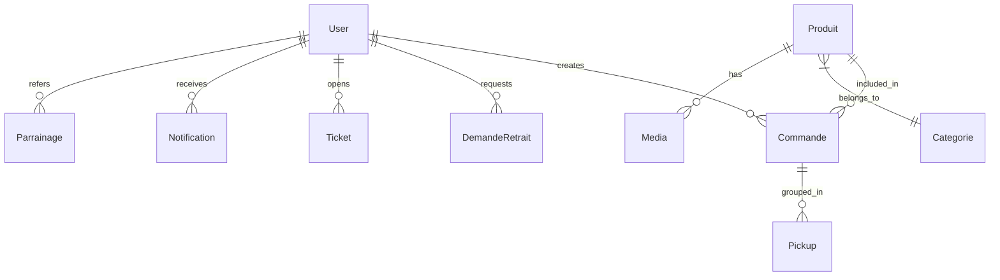

# Sprint — OpenAPI 3.0 Swagger Documentation

**Date:** 2026-03-07
**Status:** Deployed
**Author:** Claude Code

---

## 1. Goal

Expose the full Nexa API surface as a public, interactive OpenAPI 3.0.3 specification:
- Human-readable Swagger UI accessible publicly at `https://nexa-tn.com/api/docs`
- Machine-readable JSON spec at `https://nexa-tn.com/api/docs/spec.json` for SDK generation, Postman import, or CI contract tests

---

## 2. Architecture



---

## 3. Implementation

### 3.1 Packages Added

| Package | Version | Role |
|---------|---------|------|
| `swagger-jsdoc` | ^6.x | Parses `@openapi` JSDoc annotations → OpenAPI spec object |
| `swagger-ui-express` | ^5.x | Serves the Swagger UI static bundle |

### 3.2 Central Config — `backend/src/config/swagger.js`

Defines the OpenAPI 3.0.3 document root:

```js
const options = {
  definition: {
    openapi: '3.0.3',
    info:    { title: 'Nexa Ecommerce API', version: '1.0.0', ... },
    servers: [ production, development ],
    tags:    [ Auth, Users, Packs, Products, Orders, ... 16 tags ],
    components: {
      securitySchemes: { cookieAuth: { type: 'apiKey', in: 'cookie', name: 'accessToken' } },
      schemas: { User, Pack, Produit, Commande, Ticket, DemandeRetrait,
                 Notification, Categorie, Permission, Task, Pickup, Parrainage, Error }
    }
  },
  apis: ['src/routes/*.js'],   // glob — picks up all @openapi blocks
};

export const swaggerSpec = swaggerJsdoc(options);
```

### 3.3 Mounting in `app.js`

```js
// spec.json MUST come before the swagger-ui middleware
// (app.use('/api/docs', ...) would intercept sub-paths otherwise)
app.get('/api/docs/spec.json', (req, res) => res.json(swaggerSpec));
app.use('/api/docs', swaggerUi.serve, swaggerUi.setup(swaggerSpec, {
  customSiteTitle: 'Nexa API Docs',
  swaggerOptions: { persistAuthorization: true },
}));
```

> **Gotcha fixed:** `app.use('/api/docs', ...)` intercepts all sub-paths including `/spec.json`. The raw JSON route must be registered first with `app.get()`.

### 3.4 Annotation Pattern (per route file)

```js
/**
 * @openapi
 * /auth/login:
 *   post:
 *     tags: [Auth]
 *     summary: Login — sets httpOnly accessToken cookie
 *     requestBody:
 *       required: true
 *       content:
 *         application/json:
 *           schema:
 *             type: object
 *             required: [email, mot_de_passe]
 *             properties:
 *               email:        { type: string, format: email }
 *               mot_de_passe: { type: string }
 *     responses:
 *       200:
 *         description: Login successful
 *         content:
 *           application/json:
 *             schema:
 *               type: object
 *               properties:
 *                 user: { $ref: '#/components/schemas/User' }
 *       401:
 *         description: Invalid credentials
 *         content:
 *           application/json:
 *             schema: { $ref: '#/components/schemas/Error' }
 */
router.post('/login', login);
```

---

## 4. Coverage

### 4.1 Endpoints by tag



### 4.2 Files changed

| File | Role |
|------|------|
| `backend/src/config/swagger.js` | **New** — OpenAPI definition + all component schemas |
| `backend/src/app.js` | Mount swagger-ui-express + spec.json route |
| `backend/src/routes/auth.js` | 9 endpoints annotated |
| `backend/src/routes/userRoutes.js` | 12 endpoints annotated |
| `backend/src/routes/packsRoutes.js` | 3 endpoints annotated |
| `backend/src/routes/produitRoutes.js` | 6 endpoints annotated |
| `backend/src/routes/commandesRoutes.js` | 13 endpoints annotated |
| `backend/src/routes/demandeRetraitRoutes.js` | 6 endpoints annotated |
| `backend/src/routes/ticketsRoutes.js` | 6 endpoints annotated |
| `backend/src/routes/admin.js` | 17 endpoints annotated |
| `backend/src/routes/specialistRoutes.js` | 10 endpoints annotated |
| `backend/src/routes/notificationsRoute.js` | 4 endpoints annotated |
| `backend/src/routes/categoriesRoute.js` | 2 endpoints annotated |
| `backend/src/routes/parrainageRoutes.js` | 3 endpoints annotated |
| `backend/src/routes/pickupRoute.js` | 4 endpoints annotated |
| `backend/src/routes/mesProduitsRoutes.js` | 3 endpoints annotated |
| `backend/src/routes/dashboardRoutes.js` | 1 endpoint annotated |
| `backend/src/routes/dashboardFRoutes.js` | 1 endpoint annotated |

---

## 5. Security Scheme



All protected routes declare `security: [{cookieAuth: []}]`. The `cookieAuth` scheme is defined as:

```yaml
securitySchemes:
  cookieAuth:
    type: apiKey
    in: cookie
    name: accessToken
```

> **Note for API clients:** Swagger UI handles cookies via the browser automatically. For Postman or SDK clients, manually include the `accessToken` cookie value in requests to protected endpoints.

---

## 6. Component Schemas



Schemas defined in `components.schemas`:

| Schema | Key fields |
|--------|-----------|
| `User` | id, nom, email, role, gouvernorat, actif, validation |
| `Pack` | id, cle, titre, prix, description |
| `Produit` | id, nom, prix_gros, stock, id_fournisseur, medias[] |
| `Media` | id, url, type |
| `Commande` | id, code, statut, total, frais_livraison |
| `Ticket` | id, code, title, status, type_id |
| `DemandeRetrait` | id, code_retrait, montant, statut |
| `Notification` | id, message, lu, createdAt |
| `Categorie` | id, nom |
| `Permission` | id, specialist_id, resource, action |
| `Task` | id, title, status, assigned_to |
| `Pickup` | id, id_fournisseur, date_pickup, statut |
| `Parrainage` | id, parrain_id, filleul_id, bonus_applique |
| `Error` | message |

---

## 7. Public Access

| URL | Content |
|-----|---------|
| `https://nexa-tn.com/api/docs` | Swagger UI (interactive) |
| `https://nexa-tn.com/api/docs/spec.json` | Raw OpenAPI 3.0.3 JSON |

No authentication required to view the docs. Individual endpoint `Try it out` calls require a valid `accessToken` cookie (obtained via `POST /auth/login`).

---

## 8. Extending the Docs

To add a new endpoint:

1. Add the route in the appropriate `src/routes/*.js` file
2. Add a `@openapi` JSDoc block above the `router.xxx(...)` call
3. Reference existing schemas with `$ref: '#/components/schemas/ModelName'`
4. To add a new schema, add it to `src/config/swagger.js` → `components.schemas`

No build step required — `swagger-jsdoc` parses comments at runtime on app startup.
